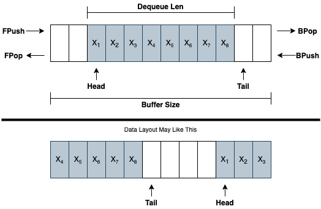

# codequeue



## Get Started

### Prerequisites

* OS: Linux
* Golang: v1.12+

### Usage

```golang
import (
    ...
    "github.com/amazingchow/codequeue"
    ...
)

...
q := codequeue.NewCoDequeue(256)
q.BPush("foo")
q.BPush("bar")

fmt.Println(q.Len())   // 2
fmt.Println(q.Front()) // "foo"
fmt.Println(q.Back())  // "bar"

q.FPop()  // remove "foo"
q.BPop()  // remove "bar"

q.FPush("hello")
q.BPush("world")

for q.Len() != 0 {
    fmt.Println(q.FPop())
}
...
```

## Contributing

### Step 1

* 🍴 Fork this repo!

### Step 2

* 🔨 HACK AWAY!

### Step 3

* 🔃 Create a new PR using https://github.com/amazingchow/codequeue/compare!

## FAQ

* refer to [FAQ](FAQ.md).

## Support

* Reach out to me at <jianzhou42@163.com>.

## License

* This project is licensed under the MIT License - see the **[MIT license](http://opensource.org/licenses/mit-license.php)** for details.
